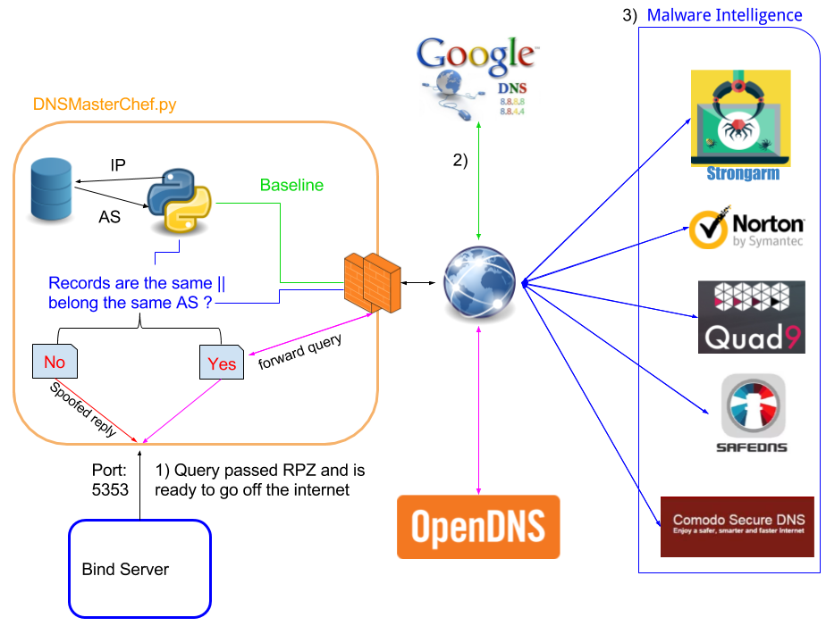

## Setting up a DNS Firewall on steroids

The idea is to setup a local Bind recursive DNS server to improve the overall security of a network by filtering known nasty domains. This is done by first configuring RPZ with multiple lists of domains/IPs to block, then using the python script I developed that allows the filtering of unsafe requests based on multiple DNS threat blocking providers.

In this POC, I'm blocking all kinds of malicious domains and IPs, as well as advertisement domains. Blocking ads not only increase the security of workstations resolving to the server (by stopping potential malvertising), but allows clients to have them blocked without any plugins or additional configuration in the browser. Another advantage of blocking at this level (DNS) is that your whole network can benefit from the filtering without having to configure any kind of proxy filtering on each client. 

DNS Firewall - a.k.a **D**omain **N**ame **S**ervice **R**esponse **P**olicy **Z**ones (DNS RPZ) is a BIND9.8.1+ feature that allows DNS server administrators to filter requests (respond with NXDOMAIN, NODATA, DROP, Local Data, ...) for certain domains, clients, IPs or even per NameServer. [This RFC draft](https://tools.ietf.org/html/draft-ietf-dnsop-dns-rpz-00) describes the technology as:

>... a method for expressing DNS response policy
>inside a specially constructed DNS zone, and for recursive name
>servers to use such policy to return modified results to DNS clients.
>The modified DNS results can stop access to selected HTTP servers,
>redirect users to "walled gardens", block objectionable email, and
>otherwise defend against attack.  These "DNS Firewalls" are widely
>used in fighting Internet crime and abuse.

While this sounds interesting, most security companies sell these services to organizations as ‘DNS FIREWALLs’ to help them stay secure. I was curious to see how good I could set up my own server to provide the same security as their paid offerings.

### Building our blacklists
The goal here is to build a massive list of domains to block for RPZ so the queries have less chances to leave the server. There's already some good projects on Github that help us to do that. For instance,[this project](https://github.com/cbuijs/dns-firewall) provides gigantic (sometimes around 80 mb) RPZ zone files ready to download and use for blocking. 

To get a better idea of what I'm going to be blocking, I used [bind-adblock](https://github.com/Trellmor/bind-adblock/). bind-adblock downloads multiple blacklists and constructs a singular BIND RPZ zone file with the parsed domains. I modified bind-adblock to construct the zone file a bit differently, and to check more closely for malformed domains before writing them to our zone file. The Python script will download and use around 25 OSINT lists for malware and ad blocking (before checking for duplicates). I forked the project so I could add more blacklists and make further adjustments. For simplicity and performance, I constructed only one zone file aggregating all of the domains. The result is a ~40mb file with ~977270 lines. It is indeed a good idea to run the script frequently so our server will have the latest intelligence. You can download bind-block-unwanted [here](https://github.com/NavyTitanium/bind-block-unwanted)

#### Whitelisting
It is always recommended to have a zone with frequently used domains as a "pass-thru" zone, so queries for those domains will not have to be compared with all blacklists. I used the Alexa top 5000 websites as my whitelist. Taking more than that could include [malicious websites](https://blog.sucuri.net/2011/03/alexa-top-100k-sites-the-malware-blues.html). [This Github page](https://github.com/secure411dotorg/rpzone/tree/master/scripts) contains scripts that allows us to easily download the Alexa top 1 million websites, cut the list to 5000 and then add the proper RPZ syntax so it can be used in a BIND zone file. 

#### Sinkhole domain
I created a local domain ***.local*** that will resolve to this same server for the sinkholing of blocked domains. In an RPZ file, it's easier to point each domain we want to block to a ***walled garden*** (with CNAME) instead of using a hardcoded IP address (with an A record). This way, if the server change its IP address, or if we want to redirect the traffic elsewhere, we would only need to edit our ***.local*** zone.

The blacklist zone will have entries like this in **/var/named/db.rpz.blacklist**:
```markdown
...
bad-domain1 IN CNAME drop.local.
bad-domain2 IN CNAME drop.local.
...
```
To make it work, we need to create the ***.local*** zone first in **/var/named/db.local**:
```markdown
@       IN      SOA     local.  root.local. (2 604800 86400 2419200 604800);
@       IN      NS      ns1.local.
@ IN A 192.168.1.220
ns1       IN    A       192.168.1.220
* A 192.168.1.220
```
The zone file will match any request to ***.local*** to the local server. We then add it to the BIND configuration file **/etc/named.conf**:
```markdown
zone "local." {
		type master;
		file "/var/named/db.local";
		allow-update { none; };
		allow-transfer { none; };
		allow-query { trusted-acl;};
};
```
### The server

My server is a minimal installation of CentOS 7.

#### Installing BIND

For this project, I compiled BIND 9.12. The procedure is well detailed [here](http://linux-sxs.org/internet_serving/bind9.html).
The only difference I made is at the compilation time. To use the DNS Response Policy Service (DNSRPS) feature in version 9.12, we need to add the **enable-dnsrps** flag:

```markdown
./configure --prefix=/usr \--sysconfdir=/etc \--enable-threads \--localstatedir=/var/state \--with-libtool \--enable-dnsrps
```
After that we can start the server:
```markdown
/usr/sbin/named -u named
```
At this point, the server is ready to resolve queries using root tld.

### Configuring BIND
Since our server will allow recursive queries, we want to make sure it is proper configured so only the intended clients can make use of it. 

We start by adding a trusted ACL to the BIND configuration file ***/etc/named.conf***:
```markdown
// Set up an ACL named "trusted-acl" that will allow
// legitimate clients to query the server
acl trusted-acl {
    127.0.0.1/32; 192.168.0.0/16;
};
```
Also, we will add a list of bogus IPs that we don't want to serve or hear replies from. This list was taken from the [team-cymru website](http://www.team-cymru.org/bogon-reference.html). I removed **127.0.0.0/8** from the list because I will communicate with the loopback for proxying requests. The range **192.168.0.0/16** is also removed from the list because it is my internal network.
```markdown
// Blacklisted bogus network range.
acl bogusnets-acl {
    0.0.0.0/8; 10.0.0.0/8;
	100.64.0.0/10; 169.254.0.0/16;
	172.16.0.0/12; 192.0.0.0/24;
	192.0.2.0/24; 198.18.0.0/15;
	198.51.100.0/24; 203.0.113.0/24;
	224.0.0.0/4; 240.0.0.0/4;
};
```
My ***options*** section look like the following in ***/etc/named.conf***:
```markdown
options {
	 // Ban bogus networks
	 blackhole { bogusnets-acl; };
	 
	 // Only allows trusted client to use the service
	 allow-query { trusted-acl; };
	 allow-recursion{ trusted-acl; };
	 allow-query-cache { trusted-acl; };
	
	 // Hiding our version
	 version "Not available";
	 
	 // Improved performance
	 minimal-any yes;
	 minimal-responses yes;
	 
	  // Interval scanning network interfaces 
	 interface-interval 0;
	 
	 // no NOTIFY messages are sent
	 notify no;
	 
	 // Ban everyone by default (transfer,update,notify)
	 allow-transfer {none;};
	 allow-update {none;};
	 allow-notify { none; };
	 allow-update-forwarding {none;};
	 
	 // Disabling DNSSEC because OpenDNS doesn't support it :(
	 dnssec-enable no;
	 dnssec-validation no;
	 
	 // IPv6
	 listen-on-v6 { any; };
	
	// Directory where bind should create files if not explicitly stated
	 directory "/var/named";

	// Forward queries
	forwarders {
		// Using OpenDNS directly for now
		208.67.222.222;
		208.67.220.220;
	};
	
	// Only forward, don't attempt to answer the query
	forward only;
};
```
#### DNSSEC ?
Unfortunately, the provider I picked up, OpenDNS, does not support DNSSEC. This is why I disabled it in the configuration file.

### Configuring the RPZ
We now need to add our RPZ to the BIND configuration in the ***options*** section. Here's what the configuration looks like in ***/etc/named.conf***:
```markdown
response-policy {
	  # Safe domains I whitelisted. Eg: Domains used to fetch OSINT lists
	  zone "rpz.safe";
	  # Alexa TOP x list
	  zone "rpz.alexa";
	  # OSINT lists aggregated
	  zone "rpz.blacklist";
};
```
Then, outside of the ***options*** section:
```markdown
# Zones definition

zone "rpz.safe" {
        type master;
        file "/var/named/db.rpz.safe";
        allow-update { none; };
        allow-transfer { none; };
        allow-query { none; };
};

zone "rpz.alexa" {
   type master;
        file "/var/named/db.rpz.alexa";
        allow-update { none; };
        allow-transfer { none; };
        allow-query { none; };
};

zone "rpz.blacklist" {
        type master;
        file "/var/named/db.rpz.blacklist";
        allow-update { none; };
        allow-transfer { none; };
        allow-query { none; };
};
```
Then, we restart the service with `rndc reload`
### Setting up our block page
After installing the HTTPD web service on the same server, I created a simple webpage informing the redirected users of the block:
``` PHP

<?php
	$url = "{$_SERVER['HTTP_HOST']}{$_SERVER['REQUEST_URI']}";
	$escaped_url = htmlspecialchars($url, ENT_QUOTES, 'UTF-8');
	
	echo '<b><h2>Your query:<br/>' . $escaped_url . '</h2></b>';
	echo '<h4>Header:</h4>';
	echo '<ul>';

	foreach($_SERVER as $h => $v)
	if (ereg('HTTP_(.+)', $h, $hp)) echo "<li>$h = $v</li>\n";
	header('Content-type: text/html');
?>
</ul>
```
### Testing new features
Adding RPZ and other features can certainly affect the performance of the server, but performance was not the goal here. That said, an additional level of caching and the blocking of ad requests could also accelerate the loading of certain web pages.
#### DNS RPS
We now have a functioning BIND server supporting DNS RPS. How can we make use of it?
>The DNS Response Policy Service (DNSRPS) API, a mechanism to allow named to use an external response policy provider, is now supported.

Unfortunately, I quickly realized that only one provider exists for this new technology, and it's implementation is proprietary. The service is called **FastRPZ** and it is from ***Farsight Security***. 
I was thinking of making my own API to leverage this new feature, but the DNS RPS API is itself not well documented outside the *.h. I decided to not go forward with this technology, and instead create something else that will allow the use of online intelligence.

#### Threat blocking DNS providers
I then read about the comparison of different ‘safe’ DNS providers. [This blog post](https://blog.cryptoaustralia.org.au/2017/12/23/best-threat-blocking-dns-providers/) shows the efficiency of multiples DNS providers against known malicious domains. The results are rather clear: some of them are blocking more than others, but they’re relying on different malware intelligence feeds, so they will also be blocking different things.

So, why couldn’t we use all of them at the same them and then decide if we goes further with the request? 

## Selectively forwarding DNS using a proxy script
I then made a **Python 3.6** script using **asyncio** to launch parallel DNS requests to those threat blocking providers to further take action on the request. My general assumptions were:
- Google public DNS [does not perform any blocking or filtering of any kind](https://developers.google.com/speed/public-dns/faq). We will then use at as a comparison to subsequent requests.
- Threat blocking DNS providers will either return a sinkhole IP address, NXdomain or nodata if the requested domain is blocked.
- Each domain requested can return multiple A records within different IP range, but they should all belong to the same AS if they aren’t blocked. 

	For example, a big network like the Netflix one can return on the first query:
```markdown
netflix.com.            59      IN      A       35.153.114.204
netflix.com.            59      IN      A       52.22.105.255
...
```
And on the second query, the same domain can return:
```markdown
netflix.com.            59      IN      A       34.194.194.106
netflix.com.            59      IN      A       54.89.0.143
...
```
But fortunately, all of those IP addresses belong to the autonomous system #14618.

- IP addresses of sinkhole servers are in a different AS than the real IP address of a malicious domain. If they’re both hosted into the same cloud provider, this assumption could be biased, but the odds are really low.
- IP address of the sinkhole servers are not always documented and can change over time. Also, some providers have different sinkhole IPs based on the threat category. So I don’t want to hardcode those values in my script and only rely on those to consider a domain unsafe.

The idea goes as follow for each requested domain name received by the script:

1. Query Google's public DNS to establish a baseline. 
	- If we received NXdomain or Nodata, the script determines that the domain is unsafe. If not:
	- Sort the returned records and put them in a list. Create a MD5 hash of the list. 
	- Find the AS number of the first record in that list
	
	Python code:
``` python
	#Establish a baseline with Google Public DNS	
	hash_baseline = hashlib.md5()
	try:
			#Lookup the 'A' record(s)
			Answers_Google = Google.query(domain, "A") 		
			
	#Domain did not resolve		
	except (dns.resolver.NXDOMAIN, dns.resolver.NoAnswer):  
			 return [False, Google.Name]
			 
	# Contain the returned A record(s)		 
	Arecords = []											
	for rdata in Answers_Google: 
		Arecords.append(rdata.address)
	
	#Looking the ASN of the first A record (sorted)
	asn_baseline = asndb.lookup(sorted(Arecords)[0])[0]	
	
	#MD5 Fingerprint of the answer is the sorted list of A record(s)
	#Because of the round-robin often used in replies.
	#Ex. NS1 returns IP X,Y and NS2 returns IP Y,X
	hash_baseline.update(str(sorted(Arecords)).encode('utf-8')) 
	
	return lookup(domain,asn_baseline,hash_baseline)
```
2. Query each chosen DNS threat blocking provider in parallel for the requested domain name. 
	- For each of the provider’s replies, If we received NXdomain or Nodata, the script return domain unsafe. If not:
	- For each of the provider’s replies, store temporary the sorted records in a list and compare its MD5 hash with the baseline. If it differs, the received records were different, so it could be that we received a sinkhole IP address. We will then compare the AS of the first record into the list with the baseline AS (obtained from Google). If the AS differ, we return that the domain is unsafe. If the AS is the same, the domain is considered safe.
	- The first response to return a negative reply (unsafe) stops all other requests and the function returns with the result. The domain has already been determined as unsafe by one provider, so there’s no point in waiting for the others to respond.
	
	Python code:
``` python
	async def check(domain,DnsResolver,asn_baseline,hash_baseline):
		try:		
			#Get the A record for the specified domain with the specified provider
			Answers = DnsResolver.query(domain, "A")		
			
		#Domain did not resolve
		except (dns.resolver.NXDOMAIN, dns.resolver.NoAnswer):  
			 return [False, DnsResolver.Name]
		
		#List of returned IP	
		Arecords = []											
		for rdata in Answers:
			Arecords.append(rdata.address)
			
		#Compare the answer with the baseline to see if record(s) differ			
		if hashlib.md5(str(sorted(Arecords)).encode('utf-8')).hexdigest() != hash_baseline.hexdigest(): 
		
			#Record(s) differ, checking if the first one is in the same BGP AS								    
			if(asndb.lookup(sorted(Arecords)[0])[0] != asn_baseline):									
				 return [False, DnsResolver.Name]
				 
		#Domain is safe		 
		return [True, DnsResolver.Name]
		
	async def main(domain,asn_baseline,hash_baseline):
		Providers = [Strongarm, NortonConnectSafe, ComodoSecure, Quad9, SafeDNS]
		with concurrent.futures.ThreadPoolExecutor(max_workers=5) as executor:
			tasks = [
				asyncio.ensure_future(check(domain, Providers[i],asn_baseline,hash_baseline))
				for i in range(len(Providers))
			]
		   
			for response,provider in await asyncio.gather(*tasks):
				#One DNS provider in the function 'check' returned False, so the domain is unsafe
				if response == False:		
					return [False, provider]
				pass
				
			#Function 'check' never returned False at this point, the domain is safe			
			return [True, provider]					
```	
3. If all providers think that the domain is safe, the script goes on and proxy the original request.
	
My POC only supports the filtering of "A" records for now. It will proxy without any checks if other record types are requested (AAAA,SRV,TSIG,....). The full code is available on [my GitHub page](https://github.com/NavyTitanium/Dns-online-filter)

### Making it useful for BIND
At this point, my simple POC was not able to proxy any DNS requests or spoof any replies. I then looked at some DNS proxy projects that were available on Github. I chose the project [DNSChef](https://github.com/iphelix/dnschef) to integrate my script after converting it from python 2.7 to 3.6. DNSChef is a highly configurable DNS proxy for Penetration Testers and Malware Analysts that allows the spoofing of replies for configured domains.

I modified most of its features so it will listen locally and forward any DNS queries coming from BIND to OpenDNS (final destination) if they are considered safe. OpenDNS is my real resolver for all unfiltered requests. This provides a last layer of filtering because they are also blocking some malicious domains. All other requests that did not pass the test will receive a spoofed reply with one of the following IPs:

- Quad9 Sinkhole = **127.0.0.2**
- Strongarm Sinkhole = **127.0.0.3**
- SafeDNS Sinkhole = **127.0.0.4**
- ComodoSecure Sinkhole = **127.0.0.5**
- NortonConnectSafe Sinkhole = **127.0.0.6**
- Google Sinkhole = **127.0.0.7** (when NXdomain is received)

This way, I will be able to match those local IPs to the corresponding threat blocking providers in my BIND RPZ policies. To do that, we need to match those sinkhole IP addresses starting with **127.0.0.x** with policies:

``` 
# In the options section of /etc/named.conf
response-policy {
		  zone "rpz.google";
		  zone "rpz.safedns";
		  zone "rpz.strongarm";
		  zone "rpz.nortonconnectsafe";
		  zone "rpz.quad9";
		  zone "rpz.comodosecure";
	};
	
# Outside of the options section in /etc/named.conf	
zone "rpz.google" {
   type master;
        file "/var/named/db.rpz.google";
        allow-update { none; };
        allow-transfer { none; };
        allow-query { none; };
};

zone "rpz.safedns" {
   type master;
        file "/var/named/db.rpz.safedns";
        allow-update { none; };
        allow-transfer { none; };
        allow-query { none; };
};

zone "rpz.strongarm" {
   type master;
        file "/var/named/db.rpz.strongarm";
        allow-update { none; };
        allow-transfer { none; };
        allow-query { none; };
};

zone "rpz.nortonconnectsafe" {
   type master;
        file "/var/named/db.rpz.nortonconnectsafe";
        allow-update { none; };
        allow-transfer { none; };
        allow-query { none; };
};

zone "rpz.quad9" {
   type master;
        file "/var/named/db.rpz.quad9";
        allow-update { none; };
        allow-transfer { none; };
        allow-query { none; };
};

zone "rpz.comodosecure" {
   type master;
        file "/var/named/db.rpz.comodosecure";
        allow-update { none; };
        allow-transfer { none; };
        allow-query { none; };
};
```
Each of those zones will contain (in their zone file) an IP Trigger policy. This policy will match the sinkhole IP address belonging to its associated provider. For example, **/var/named/db.rpz.nortonconnectsafe** contains:
``` 
$TTL 800 @ IN SOA nortonconnectsafe.local. nortonconnectsafe.local. (201702121 3600 600 86400 600) 
@ IN NS   LOCALHOST.

; IP Trigger Local-Data Action
; any answer containing IP range
32.6.0.0.127.rpz-ip CNAME nortonconnectsafedrop.local.
```
So everytime BIND receives an answer from this IP (**127.0.0.6** in this case), it will transfer it to our **walled garden** ***nortonconnectsafedrop.local*** which is resolving to this server.

This way, a user browsing to a blocked domain will:
- Generate a log entry in BIND RPZ log file telling which provider has denied the query
- Be redirected to a block page on our server (assuming we have a web server running).

Finally, if we want BIND to forward queries to the script, we need to configure it as a forwarder, so it will not contact directly the root servers, but instead the DNS proxy python script. To avoid any conflicts, I made the script listen to port 5353 on the same machine, and configure BIND accordingly:
```markdown
forwarders {
 127.0.0.1 port 5353;
};
```

Note that this python script is only meant to be a Proof Of Concept and by no means do I guarantee it to bug free. Nonetheless, I have used it personally without any problems or significant performance issues.

The worst execution time will be achieved when the domain is safe:
 Time to query Google DNS + Time of the slowest DNS provider to answer the query.
 


Full scripts and configuration files are on my [GitHub page](https://github.com/NavyTitanium/DNSMasterChef)

### References
[BIND9 - Response Policy Zone Configuration](http://www.zytrax.com/books/dns/ch7/rpz.html)

[BIND 9 Administrator Reference
Manual](https://ftp.isc.org/isc/bind9/9.12.0a1/doc/arm/Bv9ARM.pdf)

[dnsrpz.info](https://dnsrpz.info)

[lists.dns-oarc.net](https://lists.dns-oarc.net/pipermail/dns-operations/2017-October/016858.html)
